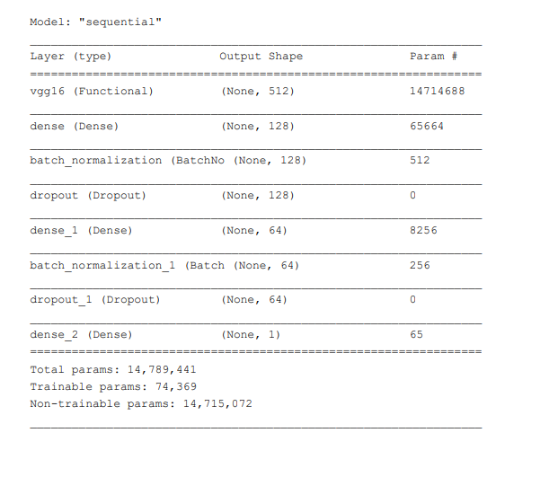

Currently, we are living in a different world because of the Covid-19 pandemic. The effects of Covid-19 have been detrimental to the world and we are still reeling from it. Loss of innumerable lives, loss of livelihoods and damage to economies are some of the calamitous effects of the pandemic. 

So, our group has decided to work on a topic related to Covid-19. There are several research areas associated with Covid-19. Our work will be focused around Covid-19 detection in patients. This will be primarily a classification project.

**This article only contains my contributions.*

# DATA
The details of the data will be discussed in the subsections.

  
**Image Classification**
- Dataset URL:
  - [https://www.kaggle.com/andyczhao/covidx-cxr2/](https://www.kaggle.com/andyczhao/covidx-cxr2/){:target="_blank"}
  - research paper of the dataset:
  - [https://www.nature.com/articles/s41598-020-76550-z](https://www.nature.com/articles/s41598-020-76550-z){:target="_blank"}
- Dataset URL:
  - [https://www.kaggle.com/mehradaria/covid19-lung-ct-scans](https://www.kaggle.com/mehradaria/covid19-lung-ct-scans){:target="_blank"}
  - research paper of the dataset:
  - [https://www.jmir.org/2021/4/e27468](https://www.jmir.org/2021/4/e27468){:target="_blank"}

**Audio Classification**
- Dataset URL:
  - [https://www.kaggle.com/andrewmvd/covid19-cough-audio-classification](https://www.kaggle.com/andrewmvd/covid19-cough-audio-classification){:target="_blank"}
  - research paper of the dataset:
  - [https://www.nature.com/articles/s41597-021-00937-4](https://www.nature.com/articles/s41597-021-00937-4){:target="_blank"}
- Dataset URL:
  - [https://github.com/iiscleap/Coswara-Data](https://github.com/iiscleap/Coswara-Data){:target="_blank"}
  - Research paper of the dataset:
  - [https://arxiv.org/abs/2005.10548](https://arxiv.org/abs/2005.10548){:target="_blank"}

# Image Classification

For the image classification, we will be following a dual pathway: We will extract features from the images and then use these as inputs to ML techniques such as KNN and Logistic Regression. For image classification tasks, our primary focus will be on using convolutional neural networks (CNN). Our plan is to initially construct a basic CNN model using our own architecture and analyze the performance. Then we would like to utilize the concepts of transfer learning and fine-tuning for classification. We would like to use pre-trained models/networks such as VGG16 and Resnet18 to understand whether we can improve upon our base CNN model

For the image classification, we will be following a dual pathway:
- We will extract features from the images and then use these as inputs to ML techniques such as KNN and Logistic Regression.
- For image classification tasks, our primary focus will be on using convolutional neural networks (CNN). Our plan is to initially construct a basic CNN model using our own architecture and analyze the performance. Then we would like to utilize the concepts of transfer learning and fine-tuning for classification. We would like to use pre-trained models/networks such as VGG16 and Resnet18 to understand whether we can improve upon our base CNN model

For this dataset, we have the data as following:
- Negative and positive values of train:
  - positive 16490
  - negative 13992

- Negative and positive values of test:
  - positive 200
  - negative 200 

For each of the observations, it is a jpg/png file with 200X200 pixels and 3 color channels.
## Preprocessing
For the dataset, we applied downsampling due to the unbalanced data. However, we made a mistake that caused the data to still be unbalanced. We will fix it in our final
report. 

For the KNN, we only applied scale on the dataset. We did not apply any augmentation on the dataset since we want to find the shortest distance, augmentation may cause the error after shifting the image. 

For the Convolution Neural Networks, we applied scale and augmentation on our own baseline CNN. For the transfer learning built by VGG16, we applied the VGG16 preprocessing.
The dataset looks like the following:

Fig 1. Scale(Left) and VGG16 Preprocessing(Right).

# Model
**KNN(baseline):**
We apply a KNN model with K = 2
**CNN:**
We applied two convolutional layers with kernel size = 5, two max-pooling layers with size = 4, and two dense layers. We applied relu as the activation function in the hidden layer and sigmoid in the output layer. We also used Dropout and Batch Normalization for avoiding overfitting. The detail of the model is shown below:

Fig 2. CNN model.

**VGG16**
We applied a VGG16 layer and two dense layers. We applied relu as the activation function in the hidden layer and sigmoid in the output layer. We applied sigmoid in the output layer. The detail of the model is shown below:

Fig 3. VGG-16 model.

# Result
We used Accuracy as our evaluation metric. 

For KNN(baseline), we have an accuracy of 0.69 on the testing set( could be improved significantly after we balanced the data). Also, due to the limitation of the memory, we cannot use every data in the data set to calculate the distance. 

For CNN, we have an accuracy of 0.9993 on the training set, 0.9850 on the validation set, and 0.9525 on the testing set( could be improved after we balanced the data) after finishing the train in 12843.5s (3.6 hours). The learning curve is the following:

Fig 4. CNN Training.

For VGG16 we have an accuracy of 0.9945 on the training set, 0.9764 on the validation set, and 0.9725 on the testing set( could be improved after we balanced the data)after finishing the train in 6705.2s (1.8 hours). The learning curve is the following:

Fig 5. VGG-16 Training.

Comparing the baseline KNN with our own CNN and VGG16, we can easily see a significant improvement in the performance. Comparing the CNN with VGG16, not only our test set accuracy improved, but we also saved time (1.8 hours!). This shows how powerful transfer learning is. It saves time and improves accuracy.

# Analysis
Even before the training process, I can classify by visual inspection (with my eyes), since there is a high chance that a positive image had some “shadow” in their lungs. Hence, letting the computer learn the image seems a possible approach. With the 0.9725 accuracies in the test set by VGG16, we can assume our approach to detect Covid-19 by analyzing the image of the lung X-ray scan of a patient is feasible. There is a thought that we can apply YOLO v5 to this dataset. If we are detecting Covid-19 by recognizing some “shadow” in the lungs, we may use YOLO to do it.