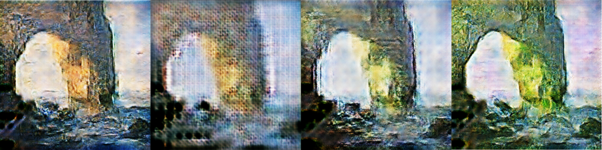
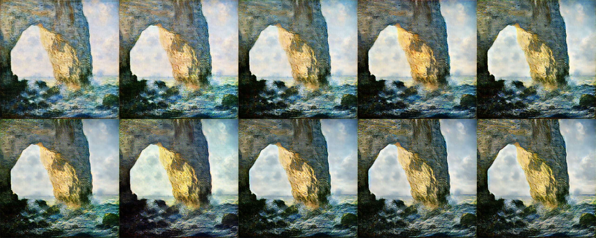

The ability to transmit style from one image to another is very valuable in the industry. For example, painting designs by artificial intelligence have created great financial value in the art market. It may also be used to manipulate the appearance and style of photos and movies. The application of famous painters’ styles to everyday works of art is a typical occurrence. With generative adversarial networks (GAN), we propose to use deep learning neural networks to achieve style learning and transfer to new images.

Fig 1. “Impression, Sunrise” transfer to Van Gogh style.

Fig 2. “The Starry Night” transfer to Monet style.

# Related Work / Literature Survey
## Generative Adversarial Networks (GANs)
Generative adversarial networks (GANs) is one of the best approaches to image generation. Its goal is to
train two models, a generative model, and a discriminative model. The generative model is an unsupervised machine learning model that involves learning the patterns within the training data and automatically generating new samples based on the training data patterns. The discriminative model is trained
to classify and distinguish fake samples from real samples. In the GANs framework, the generative model
generates “fake” samples and the discriminative model tries to distinguish the “fake” samples from the
real ones. The framework favors the generative model and is trained until the generative model generates
“fake” samples that are indistinguishable from the real samples [1].

## CycleGAN 

Fig 3. The CycleGAN architecture taken from the original paper [4].

Image to image translation typically requires paired samples, one in each of the input and target domains. However, it is hard or impossible to obtain such paired samples. The CycleGAN architecture solves this problem. It is an extension of the GAN architecture that trains two generator models and two discriminator models. The idea is to train the first generator to map images x in the input domain X to images in the output domain Y . The second generator does the reverse. The two discriminator models are trained to discriminate between real and generated images in the two domains. In addition, CycleGAN also introduces a cycle consistency concept, stating that for any input image x ∈ X, we apply the generator GX to it, we get the generated image in the target domain GX(x), then if we apply the generator GY to the generated image, the final image GY (GX(x)) should match the original image x [4]. We will be building an architecture similar to CycleGAN to perform our style transfer.

## U-Net 

Fig 4. The U-Net architecture taken from the original paper [3].

Unlike typical convolution neural networks (CNNs) that perform classification tasks, the U-net architecture produces an output that provides localization where labels are assigned to a certain location of the image. The network performs downsampling like a typical CNN but subsequently performs upsampling to increase resolution. This upsampling operation allows context information to be propagated to higher resolution layers, resulting in an image output that is the same size as the original [3]. This model will be used in the development of our architecture.

## Dataset / Pre-processing 
In our datasets (taken from Kaggle competitions), we apply Monet and Van Gogh’s painting images as targets. The dataset contains two classes of images: Monet images and normal images. Each of them contains two formats of data, tfrecords and JPEG. We decided to use tfrecords as our training data because they are memory-efficient and easy to use with either Tensorflow or Pytorch. JPEG images are also useful when we explore, test, and evaluate the models. In addition to that, we plan to use more Monet-style images from generators of other GAN architectures like DCGAN. In total, we have 300 Monet paintings, 540 Van Gogh paintings, and 7028 normal photos with 256 × 256. In terms of preprocessing, we plan to augment our training set with variations of original images like cropping, rotating, and other transformations. This method works because these transformations of images do not disrupt the artistic styles of the paintings. 
## Methodology 
Our problem may be thought of as an image-to-image conversion. The purpose is to learn a mapping G : X → Y that converts an image x ∈ X to y ∈ Y . We will be building an architecture similar to that of CycleGAN, using the U-net architecture in the generator. 
Our goal is to train two generator models using the CycleGAN architecture. The two generator models generate images from the input domain to the target domain and back. We also train two discriminator models to differentiate the images in the two domains. The ultimate goal is for the two generator models to generate images that cannot be distinguished by the discriminator models. In addition, we would also like to ensure cycle consistency by making sure that an image can be transformed from the input style to the target style and back again. This cycle consistency ensures that we have x → G_X(x) → G_Y (G_X(x)) → x, where x is an image in the input domain, G_X is the generator model that generates a target image from the input image, and GY is the reverse generator model that generates an input image from the target image. Cycle consistency ensures that the input image matches the final output image by applying two generator transformations.

In our project, we define the following domains:
* Domain D_M: Domain of Monet’s paintings
* Domain D_V : Domain of Van Gogh’s paintings
* Domain D_P : Domain of ordinary photos

We also define the following generator models:
* Generator G_P2M: Generates Monet style images from ordinary photos, D_P → D_M
* Generator G_M2P : Generates ordinary photos from Monet style images, D_M → D_P
* Generator G_P2V : Generates Van Gogh style images from ordinary photos, D_P → D——V
* Generator G_V2P : Generates ordinary photos from Van Gogh style images, D_V → D_P
* Generator G_V2M: Generates Monet style images from Van Gogh style images, D_V → D_M
* Generator G_M2V : Generates Van Gogh style images from Monet style images, D_M → D_V

For the generator, we plan to apply seven convolution layers with a kernel size of 4 for the downsampling, seven transpose convolution layers with a kernel size of 4 for the upsampling, and concatenate the downsampling and upsampling layers in the same depth. Since a powerful discriminator will cause low performance for the whole model, it will be a simple convolution neural network. 
Due to the lack of paired data to train on in CycleGAN, there is no guarantee that the input x and target y pair will be relevant throughout training. The author from the original paper suggested we use the cycle consistency loss (the output should be close to the original input) to ensure that the network learns the correct mapping. Therefore, for the generator, we will compare the result with the value of the true label (suppose we use 1) to let the generator learn how to make the target image. For the discriminator, we will compare the real photo with the value of the true label and the generated photo with the value of the fake label (suppose we use 0) since we want the discriminator to learn to distinguish between the true and fake. For the current stage, we plan to use BinaryCrossEntropy to calculate the loss. We will use Adam as our optimizer.

# Prototype & Results 
Initially, we thought that we only needed to build a CycleGAN model to train the transfer of Monet style and Van Gogh style. However, due to the limit-sized training set (only a few hundred paintings), the effect of style transfer was very insignificant. We can only see a change in hue (swap of blue and yellow). 
So we thought maybe we could find an intermediate term that would help us convert. So we designed two CycleGAN models, one for the transfer between Monet style and real photos, and one for the transfer between Van Gogh style and real photos. In the end, we only need to convert the Monet style (Van Gogh style) painting into a real photo and then convert the real photo into a Van Gogh style (Monet style). 
It turned out that the attempt was correct, and we were able to notice that the new model not only changed the hue, but also the way of painting differently. 
We will show our prototype and results in the following sections.

## The Original Model (Failed Attempt)

**Failed Attempt 1**
In this attempt, we try to train two generators G_M2P and G_P2M, as defined above. We decided to use a shallow network due to the lack of GPUs. The model is underfitting. We can see from the results that the generated images in Figures 1 and 2 are of low quality.

Fig 5. Failed Monet style generator 1 training process epoch 1 through 4.

Fig 6. Failed photo generator 1 training process epoch 1 through 4.

**Failed Attempt 2**
In this attempt, we try to train the same two generators G_M2P and G_P2M. 
This is another failed attempt we would like to mention. Also for the same reason of saving training time, we tried to train the model with a large learning rate (0.002). The generator learns faster at the beginning, so does the discriminator. However, the generator failed as the discriminator became extremely accurate (the loss is close to zero). We believe that if the discriminator is too powerful at the beginning of the training, the generator will meet problems as the gradient explodes due to the large loss reflected by the discriminator.

Fig 7. Failed Monet style generator 2 training process epoch 1 through 5.

Fig 8.  Failed photo generator 2 training process epoch 1 through 5.

## The New Model
**Train Steps**

Fig 9. Monet style generator training process epoch 1 through 10.

Fig 10. Photo generator (from Monet style) training process epoch 1 through 10.

**Train Result**

Fig 11. Sample results of Photo → Monet → Photo cycle.

## The Final Model

Fig 12. Sample results of Monet → Photo → Van Gogh.

Fig 13. Sample results of Monet → Photo → Van Gogh.

Fig 14.  Selected good results of Monet → Photo → Van Gogh.

# Future Work 
On top of the CycleGAN method, we plan to improve the results by both adding more training effort and iterating on our model architecture. 
First, we used the same training set of real photos for both Monet and Van Gogh style transfer training. However, we found many portraits in Van Gogh’s paintings, and the style transfer of these portraits is not ideal. Perhaps we should add more portraits to our training in Van Gogh style and real photo transformations. 
Moreover, currently we are training two CycleGAN models separately, we might try to train them together. We expect to see the two interact with each other and learn faster and better. 
Also, there is a more powerful style learning framework called StyleGAN [2]. It is worth trying. We would like to compare the two models and integrate them to produce an even better overall model.

Click [HERE](https://github.com/HarryGYao/Monet-Van_Gogh_CycleGAN/){:target="_blank"} to see more about the project.

# References
[1] Ian J. Goodfellow, Jean Pouget-Abadie, Mehdi Mirza, Bing Xu, David Warde-Farley, Sherjil Ozair,
Aaron Courville, and Yoshua Bengio. Generative adversarial networks, 2014.
[2] Tero Karras, Samuli Laine, and Timo Aila. A style-based generator architecture for generative adversarial networks, 2018.
[3] Olaf Ronneberger, Philipp Fischer, and Thomas Brox. U-net: Convolutional networks for biomedical
image segmentation, 2015.
[4] Jun-Yan Zhu, Taesung Park, Phillip Isola, and Alexei A. Efros. Unpaired image-to-image translation
using cycle-consistent adversarial networks, 2020.

