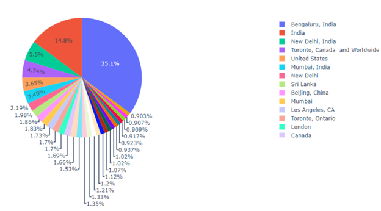

# Problem Statement 
For this course, the focus will be more on the application of using existing models or tools to analyze the Twitter data instead of training any model with the data. The analysis will focus on how the topics, sentiment, and public opinion against the COVID-19 changed over time and what event happened causing the changes. For example, there could be a significant change in the public opinion about how we live with COVID-19 when the COVID-19 Vaccines are approved. Therefore, the task is to find the cluster of those on Twitter having the same opinion and figure out how and when it changed

# Dataset
The following dataset contains collected tweets related to the COVID-19 vaccines used in the entire world on a large scale, such as Pfizer/BioNTech, Moderna used in the US, Sinovac used in China, Bharat Biotech used in India, Sputnik V used in Russia, and AstraZeneca in the UK through December 2020 to November 2021.

COVID-19 All Vaccines Tweets: Click [HERE](https://www.kaggle.com/datasets/gpreda/all-covid19-vaccines-tweets){:target="_blank"}

Fig1. Cleaned text of tweets.

Several usual data cleaning techniques are applied to prepare the data. It includes setting the tweets to lower case, removing all the hashtags, URLs, user handles, multiple spaces, special characters, single characters, and stop words. Moreover, those empty or duplicate tweets dropped. The final text looks like the chart in Fig1

# Proposed Solution 
The dataset, nltk and sklearn package, is used in this report for analysis. The nltk package is used to analyze the sentiment of the tweets, and sklearn is used to calculate the linear and polynomial regression of the change or tend regard to tweet.

# The Result and Analysis

Fig2. Geolocation information of tweets.

In this dataset, for the top 30 locations, half of the tweets come from India, North America, and 
the rest of the world. It is evident that the geolocation information needs more cleaning because 
some of them use state-level like Los Angeles, California, while others may in country-level like 
India. This problem will talk about it in the later section.

Fig3. User social media platform of tweets.

For the social media platform, a quarter of the users use Android, a quarter of the user use iPhone, 
21% of users use the web browser, and the rest of the users sent tweets from different social media 
platforms like Instagram.

Fig4. Sentiment analysis of the whole dataset.

For the sentiment analysis, Neutral sentiment hold the dominate place, and positive is twice of negative sentiment.

Fig5. Number of tweets posted everyday. 

Fig 5 shows how the number of tweets posted every day changed the count over time. It is easy to find related important Vaccine news or tweets posted by authority accounts for every peak. For example, on March 1st, there were 2905 tweets related to the vaccine after FDA authorized J &J vaccine. On November 3rd, there were 2151 tweets after the US government claimed 5 to 11-age children could get the vaccine. The linear and polynomial regression indicated that the number of vaccine topics is increasing overall. Even though there is no causation, there is a correlation between the news and the tweets.

Fig6. Everyday tweets sentiment. 

The number of tweets changed with the related news or event, but the sentiment also changed. For example, on January 16th, CDC said we are in the earlier peaks of the pandemic, and the public sentiment tends to be negative. On November 3rd, as mentioned above, the US government claimed that 5 to 11-age children could get the vaccine, and the public sentiment tends to be positive. The regression shows that overall, the sentiment is increasing. Moreover, the sentiment analysis is applied to five different vaccines, including AstraZeneca, Moderna, Pfizer BioNTech, Bharat Biotech, and Sputnik V. 

Fig7. Sentiment related to different vaccines. 

The following shows how the sentiment change for different vaccines.

Fig8. Sentiment related to AstraZeneca. 

Fig9. Sentiment related to Moderna. 

Fig10. Sentiment related to Pfizer. 

Fig11. Sentiment related to Bharat Biotech. 

Fig12. Sentiment related to Sputnik V. 

However, this is a kind of failed attempt. Of course, the graph and the regression are successfully retrieved by the dataset. However, there is no strong connection between the sentiment and the relevant events or news. For most of the peaks in the graphs, there are only one or two tweets on that day causing extreme sentiment.

# Remarks and Future Work 
Above is the current analysis. However, many challenges are needed to be solved in the data cleaning part. First, the tweets, as mentioned above, removing all special characters is not the best cleaning strategy because some brands like Johnson & Johnson will be removed. Also, this cleaning way will remove useful information like tweets to official accounts regarding user.

Fig13. Uncleaned geolocation information. 

Secondary, the geolocation information is needed to be cleaned. The previous section only shows the top 30 locations because there is a threshold set to 500. If a location appears less than the threshold, it will be tread as other locations, and 65% of them are the other place. Clean this data is a difficult challenge. First, some of the locations are state-level, like San Diego, California, while others may be country-level, like the United States, and some are just the name of the city. It will not be easy to classify them. Second, most locations only appear once and are not written in English, so it has to be translated before classifying them.

Fig14. True distribution of the geolocation information.

Fig15. Duplicate tweets causing extreme sentiment

Third, the duplicate tweets are needed to be cleaned. In the cleaning step, the duplicate row is dropped, and the same tweet sent by different accounts and similar tweets are not dropped. This caused a big problem. For example, on August 13, there was a negative peak in sentiment. It was also caused by a huge number of this tweets sent on that day. 

After solving this problem, the goal aims to analyze the sentiment of vaccine tweets at the state level. Furthermore, the goal also aims to build some model to predict the Covid-19 situation in a different location based on the sentiment of the tweets from that place.

