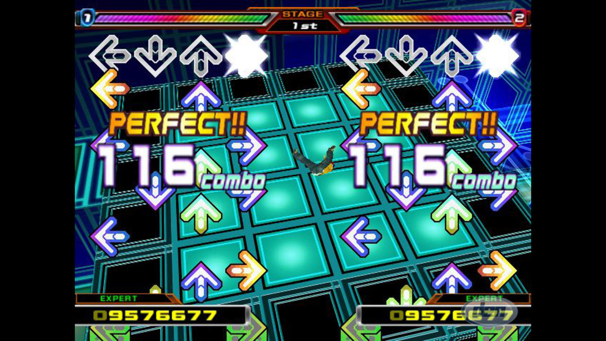
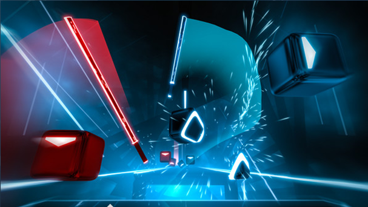

# Project description
Augmented reality (AR) is the first thought of the direction of computer vision game comes in my mind. AR allows us to interact with visual object in the real-world environment. As a video game player, I believe the most interactive game must be the rhythm game. Therefore, my project goal is developing a rhythm game using camara as the input source based on the similar game play mode like the game named beat saber.

**Rhythm game**

Fig. 1. Traditional rhythm game.

A rhythm game, sometimes known as a rhythm action game, is a music-themed action video game that tests the player\'s sense of rhythm. The genre\'s games usually revolve around dance or the simulated performance of musical instruments, and players are required to push buttons in a specific order as shown on the screen. While traditional game controllers can be utilized as input devices, rhythm games frequently include innovative game controllers that mimic musical instruments.

**Beat Saber**

Fig. 2. Beat Saber.

I am inspired by a rhythm game named Beat Saber. The player has a blue and a red lightsaber in each hand. When the music starts, small bricks with colored arrows start gliding toward the player, similar to other rhythm games, and it is up to the player to hit the bricks in the direction indicated by the arrow. There will be impediments in the path that the player must avoid with the body and sabers. To deliver the same play mode, I detect the finger of the player and use the finger as the lightsaber to hit the bricks.

# Design

## Packages

**OpenCV**

OpenCV (Open-Source Computer Vision Library) is a free software library for computer vision and machine learning. OpenCV was created to provide a common infrastructure for computer vision applications and help commercial goods incorporate machine perception more quickly. Because OpenCV is a BSD-licensed software, it is simple for businesses to use and alter the code. [3]

**MediaPipe**

MediaPipe is a framework for creating machine learning pipelines for time-series data such as video and audio. This cross-platform Framework is compatible with desktop/server, Android, iOS, and embedded devices like the Raspberry Pi and Jetson Nano. [4] 

**Pygame**

Pygame is a collection of Python modules for making video games. On top of the excellent SDL library, Pygame adds capabilities. This allows you to use Python to construct full-featured games and multimedia programs. [5]

## Class Design

In order to decouple and make subsequent development easier, I have designed the following three classes:

**Button**

This class implements the function for the menu button in the game interface. It holds the position of the button in the screen, texture of the button and return value if the button is clicked by the mouse.
The following two classes are like the music sheet in the real world. The Brick class is the music note, which defines what it looks like and the duration. The Sheet class is the music sheet, and it saves the note(brick)’s position and time it appears.

**Brick**

This class implements the brick showing on the screen beside containing the texture of the brick. The brick also changes its status and texture based on the hit timing. The other important field is lifespan. As the game progresses, the brick will remove from the game. The lifespan field self-manages the time the brick disappeared from the screen. For example, after one second of the brick is created, the brick will be destroyed and removed from the memory.

**Sheet**

This is a factory class that produces or hold different brick. It saves the brick's position on the screen and the time when the brick appears.

## Workflow

The workflow of the game is: First, getting a frame from the camera by OpenCV and then detecting the hand by mediapipe. For each hand, detect the collision with brick on the screen. Finally, Change the brick status, record the score, and move to the next frame.
To be more specific on how the brick status change, the brick will change to a different texture and return a different score based on how much time the lifespan remains when the play hits the brick. Once the Sheet class generates a brick, that brick will exist for one second. If the player hits the brick in +/- 0.4 seconds, the brick will change to a correct green mark which indicates perfect timing and given a high score;  if the player hits the brick in +/- 0.8 seconds, the brick will change to a good blue mark which indicating good timing and given a middle score; if the player did not hit the brick in1 second, which means the brick is “dead” and will be self-destroyed, the brick would change to a missing yellow mark which indicating bad timing and given a negative score; if the player hit the brick in a wrong direction, no matter when the brick is hit, the brick will change to a red error mark which indicating wrong direction hit and given a negative score. After the brick changes its status to one of four, it will remain on the screen for another 0.7 seconds.

Fig. 3. The possible status of brick after hit.

**Direction Detection**

Since this is a real-time AR game, the time for generating each frame is limited. If the code only generates ten frames per second, the game will be a bad experience for the player. Saving time is the first goal of the design process.
The first way is the detect if the finger crosses the correct boundary of the brick. However, since the video is not continued, it will miss the moment that the finger crosses the boundary. Hence, there is no way to detect the collision between the finger and the boundary. The second way is connecting the position of the finger between two same fingers in two frame and then testing if this line collied with the boundary. Not sure if it is time-consuming to detect line collisions, but if the line cross two boundaries, we have to figure out how to determine which boundary is crossed first.

Fig. 4. Invisible Bunny in World of Warcraft

A long time ago, I heard there was an invisible bunny method applied in the game of World of Warcraft [7]. In the World of Warcraft, most magic spells need to be cast on a target. However, some spells need to be untargeted. 

Fig. 5. Hitting in the right direction will always pass the invisible
brick

Hence, the game designer sets those invisible bunnies as the cast target, and the player will see the effect as untargeted. I applied a similar concept in my game (invisible bricks instead of bunnies). Since if the finger hits the brick in the correct direction needs to be passing the area next to the correct boundary, I set an invisible brick next to the target brick. In other words, I make the boundary change from a line to an area. Therefore, if the finger collided with the invisible brick on the last frame, then it indicates the finger is hitting the target brick in the correct direction like showing in the Fig. 5.

##UI Design

The following is the gameplay interface UI. All textures and icons are designed by myself. The lightsaber is modified from the public domain picture [6] 

 

Fig. 6. a. Dotted box(left) b. Brick(right)

   

Fig. 7. Brick Status

From left to right on Fig. 7, they are the brick status texture for perfect time, good timing, missing, and wrong direction.

  

Fig. 8. a. Start Button(left) b. Restart Button (right)

 

Fig. 9. Lightsaber

The original Fig. 9 has a white background, I removed it so it can be applied in the game.

**Finger Enhancement**

To make the game more like the Beat Saber, I attached a lightsaber texture to the index finger. There is not too much math on attaching the lightsaber to the finger. Basically, I choose two landmarks of the hand, which are given by the mediapipe. Then use arctan to calculate the angle and rotate the lightsaber to plot it on the index finger.

**Demo**\
The following are the YouTube Video of the gameplay:

{:target="_blank"}

Video 1. Demo

This is the Demo of the game. 

# Remarks and Future Work

The first need to be solved in future work is direction detection. Currently, it works for most cases. However, when one finger is holding the hidden direction brick, and another finger hits the target brick in any direction will be considered a legal move. Secondly, the time of calculating the direction needs more experiment. I use my intuition to design this “fast” direction detection, but I never test if it is a fast way. 

Moreover, more studies can be done to improve the FPS. For example, we can sacrifice some display delay for more time to generate frames to make the game smoother. There should be a balance between the time delay and the FPS rate.

Click [HERE](https://github.com/HarryGYao/Finger-Saber/){:target="_blank"} to see more about the project.

# References

[1] 	A. T. a. Games, "Frag Reel Friday: Rhythm Games (Part One)," ABC Technology and Games, 04 May 2012. [Online]. Available: https://www.abc.net.au/technology/articles/2012/05/04/3495499.htm. [Accessed 05 June 2022].

[2] 	B. s. o. steam, "Beat saber on steam," steam, [Online]. Available: https://store.steampowered.com/app/620980/Beat_Saber/. [Accessed 05 June 2022].

[3] 	OpenCV, "OpenCV," OpenCV, 04 November 2020. [Online]. Available: https://opencv.org/about/. [Accessed 05 June 2022].

[4] 	Kukil, "Introduction to MediaPipe," 01 March 2022. [Online]. Available: https://learnopencv.com/introduction-to-mediapipe/. [Accessed 07 June 2022].

[5] 	pygame, "pygame," pygame, [Online]. Available: https://www.pygame.org/wiki/about?parent=. [Accessed 05 June 2022].

[6] 	Morhig11, "Invisible bunny rabbits?," Imgur, 06 April 2016. [Online]. Available: https://imgur.com/A5ThvWS. [Accessed 07 June 2022].

[7] 	N. Grayson, "The invisible bunnies that power world of warcraft," Kotaku, 24 January 2017. [Online]. Available: https://kotaku.com/the-invisible-bunnies-that-power-world-of-warcraft-1791576630. [Accessed 07 June 2022].

[8] 	1993MR2Turbo, "An original drawing of a "Lightsaber" made in Photoshop.," 11 March 2015. [Online]. Available: https://en.wikipedia.org/wiki/Lightsaber#/media/File:Lightsaber,_silver_hilt,_blue_blade.png. [Accessed 05 June 2022].

